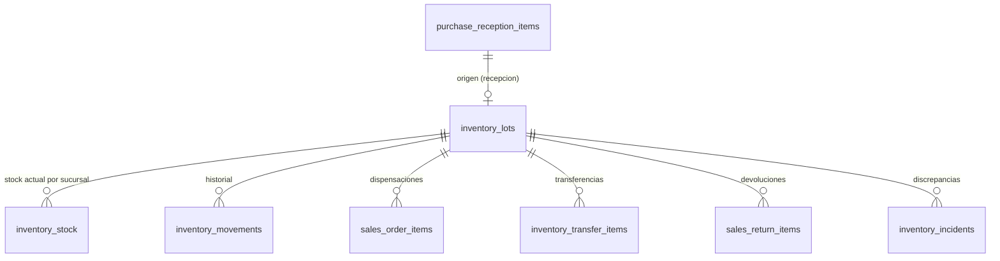
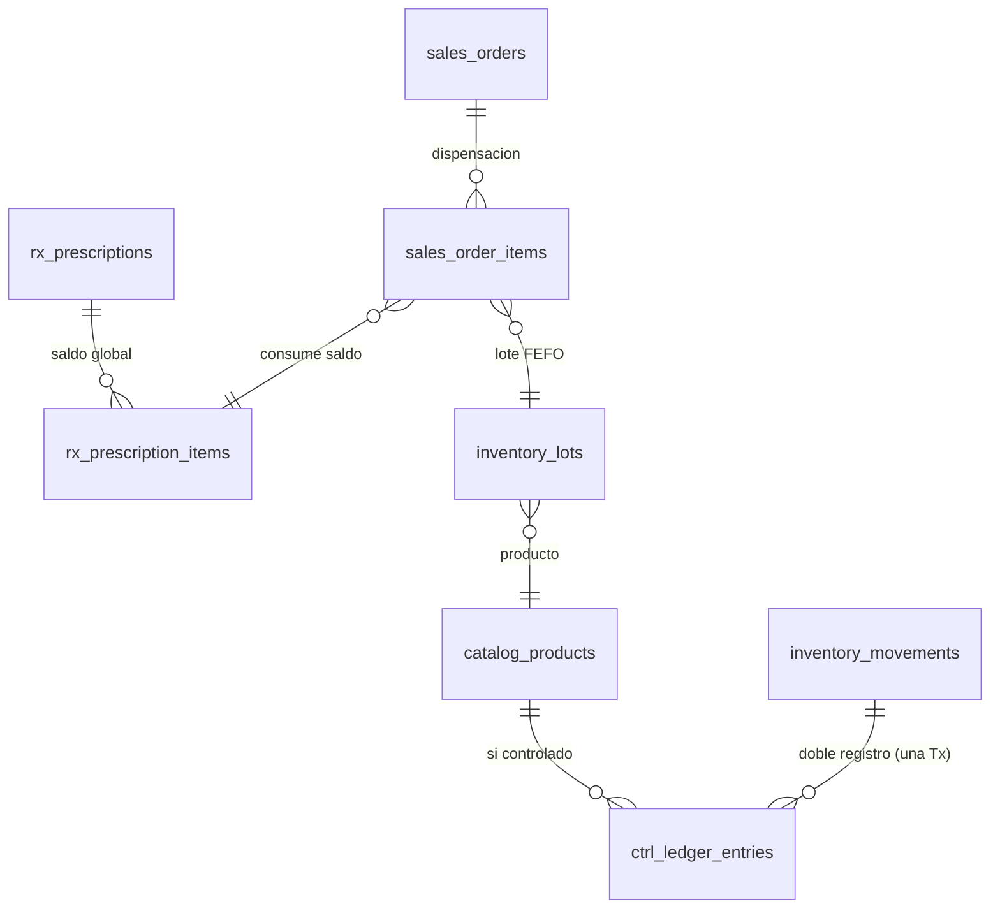

# Paso 03 — Diagrama entidad-relación

- **Workflow:** 02_database_workflow · **Paso:** 03
- **Skill utilizado:** `database-schema-designer`
- **Formato:** Mermaid (versionable). Atributos clave; el detalle va en el Paso 04 (modelo lógico).

## 1. Diagrama general

```mermaid
erDiagram
    auth_roles ||--o{ auth_role_permissions : tiene
    auth_permissions ||--o{ auth_role_permissions : asignado
    auth_users ||--o{ auth_user_roles : tiene
    auth_roles ||--o{ auth_user_roles : otorga
    auth_users ||--o{ token_blacklist : revoca

    ops_stores ||--o{ ops_registers : posee
    ops_stores ||--o{ system_config : configura

    catalog_products }o--|| catalog_categories : "pertenece (N:M via catalog_product_categories)"
    catalog_products ||--o{ catalog_prices : tiene
    catalog_products ||--o{ catalog_promotions : tiene
    catalog_suppliers ||--o{ purchase_orders : emite

    purchase_orders ||--o{ purchase_receptions : recibe
    purchase_receptions ||--o{ purchase_reception_items : detalla
    purchase_reception_items ||--o{ inventory_lots : "crea al confirmar"

    catalog_products ||--o{ inventory_lots : "genera lotes"
    inventory_lots ||--o{ inventory_stock : "stock por sucursal"
    ops_stores ||--o{ inventory_stock : "stock propio"
    inventory_lots ||--o{ inventory_movements : origina
    ops_stores ||--o{ inventory_movements : registra
    inventory_movements ||--o{ inventory_movements : "compensatorio"

    ops_stores ||--o{ inventory_transfers : "origen"
    ops_stores ||--o{ inventory_transfers : "destino"
    inventory_transfers ||--o{ inventory_transfer_items : detalla
    inventory_transfer_items }o--|| inventory_lots : "conserva lote"

    inventory_transfers ||--o{ inventory_movements : "genera salidas/entradas"
    inventory_transfers ||--o{ ctrl_ledger_entries : "asiento origen/destino (controlados)"

    inventory_lots ||--o{ inventory_reservations : "reserva (producto+sucursal)"
    ops_stores ||--o{ inventory_reservations : "reserva en"
    catalog_products ||--o{ inventory_alerts : "alerta de"
    ops_stores ||--o{ inventory_alerts : "alerta en"
    inventory_lots ||--o{ inventory_incidents : "discrepancia de"
    inventory_incidents ||--o{ inventory_movements : "ajuste autorizado"

    ops_stores ||--o{ sales_orders : "vende en"
    ops_registers ||--o{ sales_orders : "caja"
    auth_users ||--o{ sales_orders : "cajero"
    auth_users ||--o{ sales_orders : "verifica químico"
    catalog_patients ||--o{ sales_orders : "paciente (opcional)"
    sales_orders ||--o{ sales_order_items : detalla
    sales_order_items }o--|| inventory_lots : "descuenta lote (FEFO)"
    catalog_products ||--o{ sales_order_items : "producto"
    sales_orders ||--o{ payments_transactions : "pago"
    sales_orders ||--o{ sales_returns : "devolución"
    sales_returns ||--o{ sales_return_items : detalla
    sales_return_items }o--|| inventory_lots : "lote devuelto"
    sales_orders ||--o{ outbox_events : "evento (mismo Tx)"

    catalog_prescribers ||--o{ rx_prescriptions : "prescribe"
    catalog_patients ||--o{ rx_prescriptions : "receta para"
    rx_prescriptions ||--o{ rx_prescription_items : detalla
    rx_prescription_items }o--|| catalog_products : "medicamento"

    catalog_products ||--o{ ctrl_ledger_entries : "controlado"
    ops_stores ||--o{ ctrl_ledger_entries : "libro de"
    catalog_products ||--o{ ctrl_balances : "saldo"
    ops_stores ||--o{ ctrl_balances : "saldo en"

    auth_users ||--o{ audit_operations : "audita"
    auth_users ||--o{ audit_pii_access : "accede PII"
    catalog_patients ||--o{ audit_pii_access : "afectado"
    rx_prescriptions ||--o{ audit_pii_access : "afectado"

    idempotency_keys }o--|| sales_orders : "protege cobro/dispensación"
    idempotency_keys }o--|| purchase_receptions : "protege recepción"
    idempotency_keys }o--|| inventory_transfers : "protege transferencia"
```

## 2. Vistas de dominio (recortes)

### 2.1 Trazabilidad por lote (CA-10, RN-12)

### 2.2 Dispensación con receta y libro de controlados

## 3. Notas de modelado

- `inventory_stock` es la materialización del saldo por (sucursal, lote); su fuente de verdad es `inventory_movements` (RNF-024): conciliación por incidente (RF-047).
- `ctrl_balances` es la materialización del saldo permanente; su fuente de verdad son los asientos `ctrl_ledger_entries` (RF-055).
- `inventory_movements` se auto-relaciona para movimientos compensatorios (RN-10).
- Relación polimórfica movimiento↔referencia (venta, recepción, transferencia, devolución, incidente): en el modelo lógico se modela como `referencia_tipo + referencia_id` **sin FK** (limitación de modelos relacionales) — controlada por índice y documentada; alternativa FKs separadas por tipo se evalúa en el Paso 04.
- `system_config` y `ops_stores` no se relacionan directamente: el alcance global/sucursal del parámetro vive en la fila (Paso 07, §21).

## 4. Salida

- Este diagrama + `modelo_conceptual.md`.
